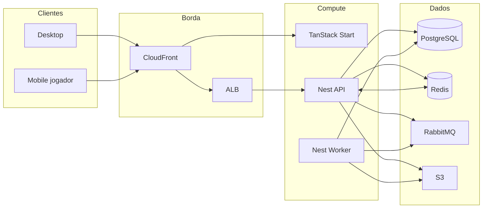

# Tileforge

Virtual Tabletop (VTT) web para criar, gerenciar e jogar RPG online.

[](LICENSE)
[](#roadmap)

---

## Sumário

- [Sobre](#sobre)
- [Escopo](#escopo)
- [Stack](#stack)
- [Arquitetura](#arquitetura)
- [Modelo de dados](#modelo-de-dados)
- [Mensageria](#mensageria)
- [Tempo real](#tempo-real)
- [Escalabilidade](#escalabilidade)
- [Estrutura do repositório](#estrutura-do-repositório)
- [Pré-requisitos](#pré-requisitos)
- [Ambiente local](#ambiente-local)
- [Convenções](#convenções)
- [Roadmap](#roadmap)
- [Licença](#licença)

---

## Sobre

O Tileforge é um VTT SaaS no navegador. O produto tem duas superfícies no mesmo codebase:

| Superfície   | Público            | Capacidade                                                             |
| ------------ | ------------------ | ---------------------------------------------------------------------- |
| Desktop      | Mestre e jogadores | Mesa completa: canvas, tokens, dados, chat, biblioteca, edição de cena |
| Mobile (PWA) | Somente jogadores  | Sessão reduzida: ficha, dados, chat, iniciativa, mapa em leitura       |

A versão mobile **não** é o desktop encolhido. O servidor expõe _capabilities_ (`canEditScene`, `canUploadMap`, etc.); o cliente mobile não carrega o editor.

---

## Escopo

### Plataforma

- Contas e autenticação
- Gerenciamento de mesas (criar, convidar, papéis mestre/jogador)
- Contatos
- Conversas (1:1 e da mesa)
- Planos e pagamentos (Mercado Pago)
- Fórum (fase posterior)

### Sessão de jogo (MVP)

- Mapa estático + grid
- Tokens com dono e arraste
- Dados compartilhados
- Chat da mesa
- Fog of war simples
- Ficha mínima
- Iniciativa

Voz e vídeo ficam de fora: a mesa usa link externo (Discord/Jitsi).

---

## Stack

### Aplicação

| Camada          | Tecnologia                                                                  | Papel                                               |
| --------------- | --------------------------------------------------------------------------- | --------------------------------------------------- |
| Linguagem       | TypeScript                                                                  | Contrato único entre apps                           |
| Front           | React, TanStack Start, TanStack Router, TanStack Query, Tailwind, shadcn/ui | Plataforma e UI da mesa                             |
| Canvas          | PixiJS                                                                      | Render da mesa (WebGL)                              |
| Mobile          | PWA, layout e _capabilities_ por dispositivo                                | Cliente do jogador                                  |
| API             | NestJS (monólito modular)                                                   | HTTP, WebSocket, módulos de domínio                 |
| Worker          | NestJS (mesmo código, outro processo)                                       | Consumidores RabbitMQ                               |
| Motor de regras | Pacote TypeScript puro                                                      | Visão, permissões, iniciativa — sem Nest e sem HTTP |
| Persistência    | PostgreSQL + Drizzle ORM                                                    | Fonte da verdade                                    |
| Sessão ao vivo  | Redis                                                                       | Snapshot, presence, adapter Socket.IO               |
| Fila            | RabbitMQ                                                                    | Jobs assíncronos                                    |
| Arquivos        | Amazon S3 + CloudFront                                                      | Mapas, tokens, avatares                             |

### Infraestrutura

| Ambiente | Tecnologia                                                                   |
| -------- | ---------------------------------------------------------------------------- |
| Local    | Docker Compose (API, worker, Postgres, Redis, RabbitMQ)                      |
| Nuvem    | AWS (ECS ou EC2 t4g, ALB, RDS, S3, CloudFront, Amazon MQ ou RabbitMQ na VPC) |
| IaC      | AWS CDK (TypeScript)                                                         |
| CI       | GitHub Actions                                                               |

Não fazem parte do desenho inicial: Next.js, Kafka, Kubernetes, MongoDB, DynamoDB, GraphQL, WebRTC, microserviços por domínio.

---

## Arquitetura

São dois contratos no mesmo produto. Fila não entra no loop da mesa.

| Camada     | Exemplos                                    | Latência    | Transporte        |
| ---------- | ------------------------------------------- | ----------- | ----------------- |
| Plataforma | Mesas, contatos, billing, histórico de chat | Segundos    | HTTP + RabbitMQ   |
| Tempo real | Token, dado, fog, cursor, **chat ao vivo**  | &lt; 100 ms | WebSocket + Redis |

Chat usa os dois: Socket.IO entrega a mensagem na hora; HTTP pagina o histórico; RabbitMQ só notifica quem está offline.

```text
[Browser / PWA]
    │
    ├─ HTTP          TanStack Start → NestJS API     plataforma + histórico
    ├─ WebSocket     Socket.IO                       sessão + chat ao vivo
    └─ (indireto)    API publica → RabbitMQ          jobs (e-mail, push, mídia)
                            └─ Worker consome
```



### Monólito modular

Um deploy, um repositório, módulos Nest por domínio:

- `Identity` — autenticação e usuários
- `Tables` — mesas, convites, papéis
- `Social` — contatos e conversas
- `Billing` — planos, webhooks, _entitlements_
- `Game` — sessão, estado, permissões de visão
- `Media` — upload e jobs de imagem
- `Forum` — fase posterior

API e worker compartilham o código; processos separados (`api` não consome fila; `worker` não recebe HTTP).

### Hexagonal (leve)

Não se aplica a todo CRUD. Portas e adaptadores entram onde a borda muda ou a regra não pode mentir:

| Área                        | Abordagem                                       |
| --------------------------- | ----------------------------------------------- |
| Motor do jogo               | Domínio puro, testável sem Nest                 |
| Billing / webhooks          | Use case + porta de pagamento + idempotência    |
| Persistência e fila         | Interface no domínio, Drizzle/RabbitMQ na infra |
| Contatos, perfil, listagens | Module Nest + service + repositório             |

O cliente **propõe** (`token.move`); o servidor **valida e broadcasta** o estado canônico. Fog e visão são regra de servidor.

---

## Modelo de dados

Três lojas, três papéis. Sem banco documental (Mongo, Dynamo, DocumentDB).

| Dado                                                      | Onde                  | Motivo                                 |
| --------------------------------------------------------- | --------------------- | -------------------------------------- |
| Usuário, mesa, convite, plano, mensagem, pagamento        | Colunas no PostgreSQL | Integridade, join, índice              |
| Snapshot de cena, ficha flexível, payload de evento       | `jsonb` no PostgreSQL | Schema irregular, ainda relacional     |
| Eventos da sessão (`TokenMoved`, `DiceRolled`)            | Tabela append-only    | Replay e auditoria                     |
| Snapshot ao vivo, presence, pub/sub Socket.IO, rate limit | Redis                 | TTL e latência; não é fonte da verdade |

Se o Redis cair, a mesa reconcilia a partir do Postgres (snapshot + eventos). Dado que não pode sumir não mora só no Redis.

Drizzle é o único acesso SQL da plataforma. Listagens usam query explícita (colunas, `JOIN`, paginação). Relacionamentos do ORM ficam para grafos pequenos. O hot path da sessão não faz `UPDATE` a cada `mousemove`: buffer no servidor e flush periódico.

---

## Mensageria

RabbitMQ é o barramento de **trabalho assíncrono**. Não transporta movimento de token nem mensagem de chat ao vivo.

A API publica e responde HTTP. Só o worker consome.

```text
exchange tileforge.events     (topic)
  billing.payment.confirmed → queue.billing.activate-plan
  table.invite.created      → queue.notify.email
                              queue.notify.push
  chat.message.created      → queue.notify.push          (destinatário offline)
  map.uploaded              → queue.media.process

exchange tileforge.dlx        (dead letter)
```

Regras:

- Ack manual, prefetch limitado, retry + DLQ
- Idempotência por `event_id` (webhooks de pagamento em especial)
- Transactional Outbox quando o evento precisa nascer na mesma transação do Postgres
- Um barramento só: RabbitMQ em produção, sem SQS no mesmo fluxo

Pagamentos: webhook do Mercado Pago → persistência bruta idempotente → fila → worker grava _entitlements_ (`max_tables`, `max_players`, `storage_mb`). Autorização lê entitlement, não `if (plan === 'pro')`.

---

## Tempo real

- Socket.IO via gateway Nest (`@nestjs/websockets`)
- Room por mesa: `table:{id}` (jogo + chat da mesa)
- Room por usuário: `user:{id}` (conversas 1:1 e presença)
- Redis adapter (`@socket.io/redis-adapter`) **desde o primeiro deploy com mais de uma task**
- Sticky session no ALB ajuda reconexão; **não** substitui o adapter

Estado da sessão: snapshot no Redis + eventos no Postgres. Cliente novo recebe snapshot e eventos a partir da `version` dele.

### Chat

A mensagem ao vivo **entra no WebSocket**. Quem está na conversa ou na mesa recebe o evento na hora, pelo mesmo canal da sessão.

| Caminho                  | Uso                                              |
| ------------------------ | ------------------------------------------------ |
| Socket.IO `chat.message` | Entrega em tempo real (mesa e 1:1)               |
| HTTP `GET` paginado      | Histórico, scroll infinito, reconexão            |
| PostgreSQL               | Persistência (fonte da verdade)                  |
| RabbitMQ                 | Push/e-mail só se o destinatário estiver offline |

Fluxo: cliente emite no WS → API valida, grava no Postgres e broadcasta no room → se houver destinatário offline, publica `chat.message.created` para o worker de notificação. A fila não intermedia quem já está conectado.

---

## Escalabilidade

O sistema é **horizontal na borda** (API, worker, TanStack Start). Uma mesa é um estado único; o produto escala **número de mesas simultâneas**, não um único mapa MMO.

Para `desiredCount > 1` funcionar (mesmo com uma réplica no dia 1):

1. Sem estado de jogo só em variável de processo
2. Socket.IO + Redis adapter
3. Worker separado da API
4. Jobs idempotentes
5. Upload apenas no S3
6. Cron com um líder ou mensagem atrasada — não `setInterval` em toda task
7. Pool Postgres pequeno por processo (~5–10 conexões)
8. Idle timeout do ALB compatível com WebSocket

Teto que réplica de API não resolve: writer único do RDS, um broker RabbitMQ, lock da mesma cena. Query e índice vêm antes de mais hardware.

---

## Estrutura do repositório

Monorepo (Turborepo):

```text
apps/
  web/              TanStack Start — plataforma e UI da mesa
  api/              NestJS — HTTP + WebSocket
  worker/           NestJS — consumidores RabbitMQ
packages/
  shared/           tipos, contratos de eventos, DTOs
  game-engine/      regras puras
infra/
  docker/           Compose local
  cdk/              IaC AWS
```

Módulo Nest típico (hexagonal leve onde cabe):

```text
src/tables/
  tables.module.ts
  tables.controller.ts
  application/invite-player.use-case.ts
  domain/table.ts
  domain/table.repository.ts
  infra/table.drizzle.repo.ts
```

---

## Pré-requisitos

- Node.js LTS
- Docker e Docker Compose
- Conta AWS (deploy)
- Conta Mercado Pago (billing, fase correspondente)

---

## Ambiente local

O Compose sobe API, worker, PostgreSQL, Redis e RabbitMQ. Comandos e variáveis de ambiente entram aqui quando a fase 0 existir.

Fluxo previsto:

```bash
# clonar
git clone https://github.com/felipe-marinho/vtt-tileforge.git
cd vtt-tileforge

# subir dependências
docker compose up -d

# instalar e desenvolver (quando o monorepo existir)
npm install
npm run dev
```

---

## Convenções

### Git

Conventional Commits, subject em português (imperativo, até 72 caracteres):

```text
tipo(escopo): descrição

- detalhe
```

Tipos: `feat`, `fix`, `docs`, `style`, `refactor`, `perf`, `test`, `chore`, `ci`, `revert`.

### Código

- TypeScript estrito
- Módulos por domínio, não por tipo de arquivo genérico
- Feature flags para superfície (`mobilePlay`, `forum`, `fog`)
- Observabilidade: logs estruturados com `traceId`; na fila, `event_id` e `routing_key`
- Testes: unitários no `game-engine`; contrato de payload da fila; e2e da plataforma depois que houver UI

### Queries

- Cada tela de lista tem query escrita para ela
- Sem N+1: nada de loop com `getById`
- Índice acompanha `WHERE` / `ORDER BY` reais
- `EXPLAIN ANALYZE` nos endpoints quentes

---

## Roadmap

| Fase | Entrega                                                 |
| ---- | ------------------------------------------------------- |
| 0    | Auth, usuário, Compose (API, Postgres, Redis, RabbitMQ) |
| 1    | Mesas e convite por e-mail (worker)                     |
| 2    | Contatos e conversas                                    |
| 3    | Mesa jogável no desktop: mapa, token, dado              |
| 4    | Cliente mobile do jogador (PWA)                         |
| 5    | Planos e Mercado Pago                                   |
| 6    | Fog, ficha, iniciativa                                  |
| 7    | Fórum                                                   |

Fórum e billing completo vêm depois de existir uma sessão de RPG jogável.

---

## Licença

Distribuído sob a licença [MIT](LICENSE). Copyright (c) 2026 Felipe Marinho.
